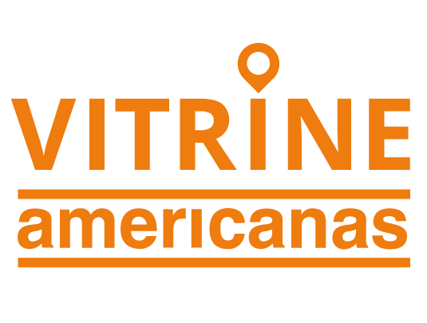

<h1 align="center">
    
</h1>

<h4 align="center">
  🚀 Vitrine Americanas
</h4>

  <a href="#rocket-tecnologias">Tecnologias</a>&nbsp;&nbsp;&nbsp;|&nbsp;&nbsp;&nbsp;
  <a href="#-projeto">Projeto</a>&nbsp;&nbsp;&nbsp;|&nbsp;&nbsp;&nbsp;
  <a href="#-layout">Layout</a>&nbsp;&nbsp;&nbsp;|&nbsp;&nbsp;&nbsp;
  <a href="#-rodando-o-projeto">Rodando o projeto</a>&nbsp;&nbsp;&nbsp;|&nbsp;&nbsp;&nbsp;

 

  

# Contributors

Thank you to all the people who have already contributed to Vitrine Americanas!

| [ <b>Higor Martins</b>](https://www.linkedin.com/in/higormartinsdasilva/)  [💻](https://github.com/MegaHack-Shawee/Mobile "Code") [📖](https://github.com/MegaHack-Shawee/Mobile "Documentation") | [ <b>Felipe Zeba</b>](https://www.linkedin.com/in/felipe-zeba/)  [💻](https://github.com/MegaHack-Shawee/Mobile "Code") [📖](https://github.com/MegaHack-Shawee/Mobile "Documentation")  | [ <b>Gabriel Portugal</b>](https://www.linkedin.com/in/gabrielrportugal/)  [💻](https://github.com/MegaHack-Shawee/Mobile "Code") [📖](https://github.com/MegaHack-Shawee/Mobile "Documentation") | [ <b>Darlielson Ferreira</b>](https://www.linkedin.com/in/darlielson-ferreira-86451168/)  [🌍](https://github.com/MegaHack-Shawee/Mobile "Business") [📖](https://github.com/MegaHack-Shawee/Mobile "Documentation") | [ <b>Amanda Freitas</b>](https://www.linkedin.com/in/amanda-freitas-39a937125/)  [🎨](https://github.com/MegaHack-Shawee/Mobile "UX/UI Designer") [💬](https://github.com/MegaHack-Shawee/Mobile "Development support") | 
| :---: | :---: | :---: | :---: | :---: | 

## QR Codes para teste

  
  
  
  
  

## :rocket: Tecnologias

Esse projeto foi desenvolvido com as seguintes tecnologias:

- [React Native](https://facebook.github.io/react-native/)
- [Redux](https://redux.js.org/)
- [Redux Persist](https://www.npmjs.com/package/redux-persist)
- [Styled Components](https://styled-components.com/)
- [Firebase](https://firebase.google.com/)
- [QRCode Scanner](https://www.npmjs.com/package/react-native-qrcode-scanner)
- [React Native Maps](https://www.npmjs.com/package/react-native-maps)

## 💻 Projeto

O Vitrine Americanas é um projeto que visa melhorar a experiência de compras dos clientes das lojas Americanas e B2W.

## 🔖 Layout

Incluir Screenshots do projeto final

## 🤔 Rodando o projeto

- Faça um fork desse repositório;
- Cria uma branch com a sua feature: `git checkout -b minha-feature`;
- Faça commit das suas alterações: `git commit -m 'feat: Minha nova feature'`;
- Faça push para a sua branch: `git push origin minha-feature`.

Depois que o merge da sua pull request for feito, você pode deletar a sua branch.

